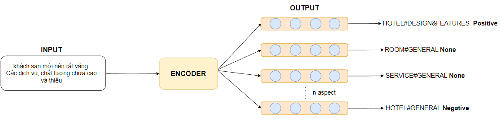
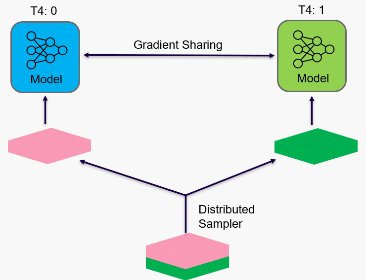
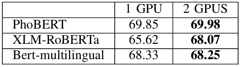
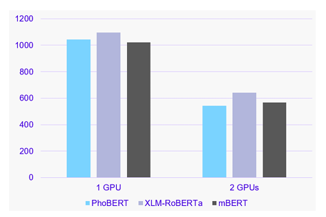
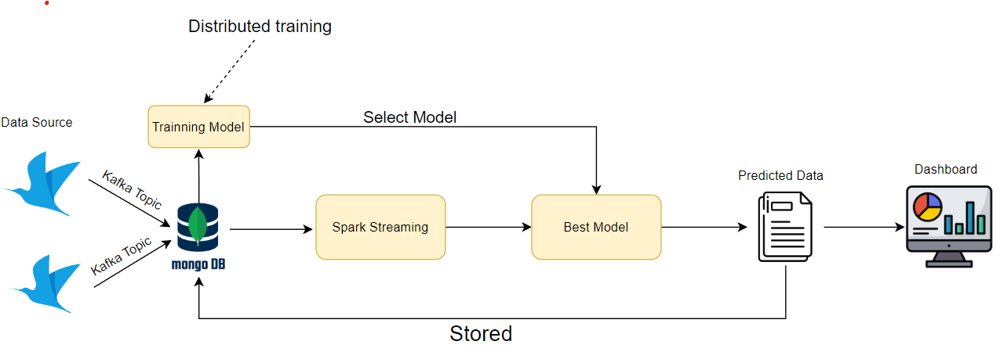

# Aspect-Category-Sentiment-Analysis-using-Real-time-Big-Data-Processing
# Overview
*  Training a model for Aspect Category Sentiment Analysis task on Hotel data
*  Build a real-time Spark dashboard interface system
  

## Table of Contents

- [Model](#model)
- [Running The Code](#running-the-code)
- [Compare with different baseline models](#compare-with-different-baseline-models)
- [Citation](#citation)
- [To Do](#todo)

# Model
Our ViMACSA dataset comprises 4,876 documents and 14,000 images. Each document is accompanied by up to 7 images. This dataset is constructed with the goal of recognizing both explicit aspects and implicit aspects in the document.

  

## Distributed Data Parallel

  

## Results

*Table 1. Results on the F1 score of the models.*

*Table 2. Detailed results of the emotion labels from the Bert-multilingual model.*

*Training time of each model.*

# Dashboard
                   
*Architecture of system*

